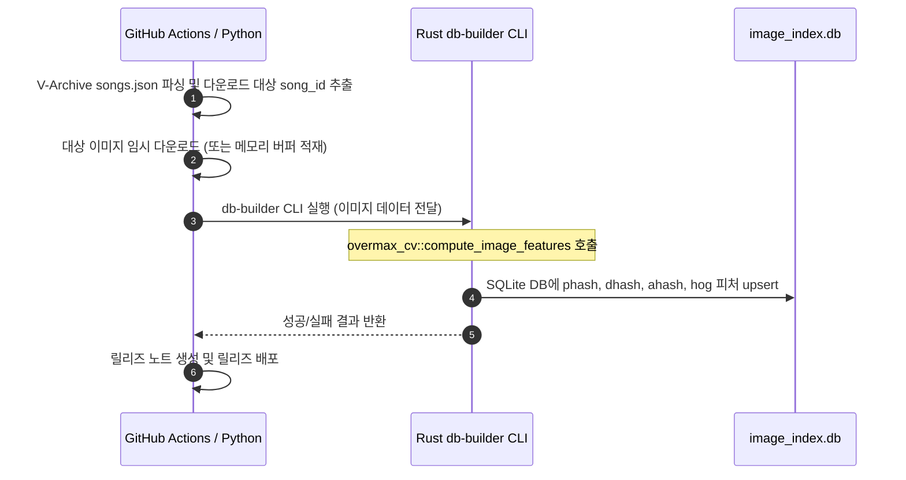
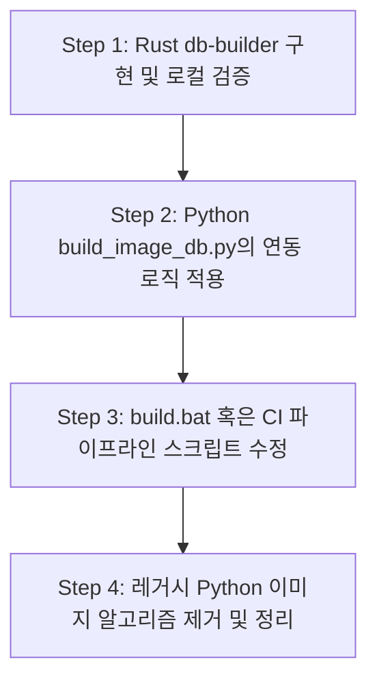

# V-Archive Jacket Image DB Redesign Plan

이 문서는 `overmax-image-db` 빌드 프로세스를 재구성하여, 이미지 피처 연산의 정밀도를 100% 일치시키고 유지보수 경계를 명확히 하기 위한 Rust CLI 도입 및 파이썬-러스트 연동 상세 설계안을 기술한다.

---

## 1. 아키텍처 개요 및 역할 경계

Rust로 마이그레이션된 핵심 이미지 분석 엔진(`overmax_cv`)을 단일 진실 공급원(SSOT)으로 삼기 위해, 이미지 다운로드/Actions 배포와 피처 연산/DB 쓰기 영역을 분리한다.



### 컴포넌트별 책임
* **`overmax-image-db` (Python/CI)**: API 연동 및 네트워크 I/O 전담
  - V-Archive API(`songs.json`) 쿼리 및 파싱
  - 신규 곡의 이미지 다운로드 및 예외 처리
  - GitHub Actions 파이프라인 관리 및 릴리즈 노트 자동 생성
* **`overmax` Core Crate (`overmax_cv` & `overmax_data` - Rust)**: 핵심 도메인 로직 및 데이터 쓰기 전담
  - HOG 및 3종 해시(pHash, dHash, aHash) 피처 연산
  - `image_index.db` 스키마 제어 및 일관된 데이터 타입 포맷팅
  - 고성능 멀티스레드 피처 연산 처리

---

## 2. 인터페이스 및 데이터 흐름 설계

파이썬 스크립트와 Rust CLI가 통신하는 방식은 두 가지 대안이 있으며, 개발 복잡도와 디스크 I/O 비용에 따라 선택할 수 있다.

### 대안 A: 로컬 디렉토리 기반 통신 (추천 - 간단하고 명확함)
파이썬이 다운로드한 이미지를 임시 폴더에 `{song_id}.jpg` 형태로 저장하고, Rust CLI에 해당 임시 폴더 경로를 인자로 넘긴다.

```bash
# 실행 예시
overmax-db-builder --image-dir ./temp_jackets --db-path ./image_index.db
```

1. **파이썬**: 신규 다운로드한 자켓 이미지를 `./temp_jackets/{song_id}.jpg`로 임시 저장
2. **Rust CLI**: `--image-dir` 내부의 파일들을 순회하면서 파일명에서 `song_id`를 추출하고 피처를 계산하여 DB에 upsert
3. **Rust CLI**: 작업 완료 후 정상 종료 코드(`exit 0`) 반환
4. **파이썬**: 임시 폴더 삭제 후 다음 파이프라인 진행

### 대안 B: Stdin 스트리밍 파이핑 (고급 - 무디스크 I/O)
파이썬에서 이미지를 다운로드한 뒤 디스크에 쓰지 않고, CLI의 표준 입력(stdin)으로 `[song_id] [이미지바이트길이] [바이트열]` 등의 커스텀 프로토콜 혹은 JSON 스트림을 파이프라이닝하여 밀어 넣는다.

* 디스크 쓰기가 전혀 없어 성능상 이점이 있으나, 스트림 파싱 프로토콜 구현 및 예외 처리가 다소 복잡해진다.

> [!TIP]
> 자켓 이미지는 장당 10KB~50KB 미만으로 매우 가벼우며 CI 환경의 로컬 디스크 쓰기 성능 영향이 미비하므로, 디버깅과 이력 관리가 용이한 **대안 A (로컬 디렉토리 기반)** 방식을 강력히 권장한다.

---

## 3. Rust `db-builder` CLI 설계 (`overmax_data` 내 구성)

새로운 크레이트를 추가하여 workspace 크기를 늘리는 대신, 이미 `overmax_cv`와 `rusqlite`를 의존성으로 가진 `overmax_data` 내부에 바이너리 타겟(`src/bin/db_builder.rs`)을 설계한다.

### `overmax_data/Cargo.toml` 설정 추가
인수 파싱을 가볍게 수행하기 위해 경량 CLI 인자 파서인 `argh`나 `clap`을 추가하거나, 의존성을 최소화하기 위해 단순 `std::env::args` 파싱을 사용한다. (여기서는 `clap`을 간결한 파생 방식으로 사용하는 것을 기준으로 예시한다.)

```toml
[dependencies]
# ... 기존 의존성
clap = { version = "4.5", features = ["derive"] }
rayon = "1.10" # 병렬 처리를 통한 고속 빌드
```

### `overmax_data/src/bin/db_builder.rs` 구현 설계안
```rust
use clap::Parser;
use std::fs;
use std::path::{Path, PathBuf};
use rayon::prelude::*;
use rusqlite::{params, Connection};

#[derive(Parser, Debug)]
#[command(author, version, about = "V-Archive Jacket Image Feature DB Builder")]
struct Args {
    /// 새로 다운로드한 자켓 이미지들이 위치한 임시 디렉토리 경로
    #[arg(short, long)]
    image_dir: PathBuf,

    /// 빌드/갱신할 SQLite image_index.db 경로
    #[arg(short, long, default_value = "image_index.db")]
    db_path: PathBuf,
}

struct ProcessTask {
    song_id: String,
    path: PathBuf,
}

fn main() -> Result<(), Box<dyn std::error::Error>> {
    let args = Args::parse();

    // 1. DB 커넥션 생성 및 스키마 보장
    let mut conn = Connection::open(&args.db_path)?;
    ensure_schema(&mut conn)?;

    // 2. 임시 디렉토리에서 이미지 파일 리스트업
    let mut tasks = Vec::new();
    for entry in fs::read_dir(&args.image_dir)? {
        let entry = entry?;
        let path = entry.path();
        if path.is_file() && path.extension().map_or(false, |ext| ext == "jpg" || ext == "png") {
            if let Some(song_id) = path.file_stem().and_then(|s| s.to_str()) {
                tasks.push(ProcessTask {
                    song_id: song_id.to_string(),
                    path,
                });
            }
        }
    }

    if tasks.is_empty() {
        println!("[Builder] 처리할 신규 이미지 파일이 없습니다.");
        return Ok(());
    }

    println!("[Builder] 총 {}개의 이미지를 처리하기 위해 피처 계산을 병렬로 시작합니다...", tasks.len());

    // 3. rayon을 통한 이미지 피처 연산 병렬화
    let results: Vec<(String, Result<(String, String, String, Vec<f32>), String>)> = tasks
        .into_par_iter()
        .map(|task| {
            let res = process_image(&task.path);
            (task.song_id, res)
        })
        .collect();

    // 4. 단일 DB 트랜잭션으로 upsert 처리
    let tx = conn.transaction()?;
    let mut success_count = 0;
    
    for (song_id, feat_res) in results {
        match feat_res {
            Ok((phash, dhash, ahash, hog)) => {
                let hog_bytes = f32_vec_to_bytes(&hog);
                tx.execute(
                    "INSERT INTO images (image_id, phash, dhash, ahash, hog, orb)
                     VALUES (?1, ?2, ?3, ?4, ?5, NULL)
                     ON CONFLICT(image_id) DO UPDATE SET
                        phash = excluded.phash,
                        dhash = excluded.dhash,
                        ahash = excluded.ahash,
                        hog   = excluded.hog,
                        orb   = NULL",
                    params![song_id, phash, dhash, ahash, hog_bytes],
                )?;
                success_count += 1;
            }
            Err(e) => {
                eprintln!("[Builder] {} 이미지 처리 실패: {}", song_id, e);
            }
        }
    }
    tx.commit()?;

    println!("[Builder] 완료: {}개 중 {}개 DB 인덱싱 성공", success_count + (results.len() - success_count), success_count);
    Ok(())
}

fn process_image(path: &Path) -> Result<(String, String, String, Vec<f32>), String> {
    // 1. 이미지 파일 바이너리 로드
    let bytes = fs::read(path).map_err(|e| e.to_string())?;
    
    // 2. image 크레이트 등으로 디코딩 (overmax_cv 내의 이미지 바이트 파싱 포맷에 맞춰 디코딩)
    // overmax_cv::image::to_gray 또는 로더에 넘겨주기 위해 원본 디코딩 정보 획득
    let img = image::load_from_memory(&bytes).map_err(|e| e.to_string())?;
    let bgra = img.to_bgra8();
    let width = bgra.width() as usize;
    let height = bgra.height() as usize;

    // 3. overmax_cv에 탑재된 동일 함수 호출
    let (phash, dhash, ahash, hog) = overmax_cv::compute_image_features(
        bgra.as_raw(),
        width,
        height,
        4
    ).map_err(|e| format!("{:?}", e))?;

    Ok((phash, dhash, ahash, hog))
}

fn ensure_schema(conn: &mut Connection) -> Result<(), rusqlite::Error> {
    conn.execute(
        "CREATE TABLE IF NOT EXISTS images (
            id       INTEGER PRIMARY KEY AUTOINCREMENT,
            image_id TEXT NOT NULL,
            phash    TEXT NOT NULL,
            dhash    TEXT NOT NULL,
            ahash    TEXT NOT NULL,
            hog      BLOB NOT NULL,
            orb      BLOB
        )",
        [],
    )?;
    conn.execute(
        "CREATE UNIQUE INDEX IF NOT EXISTS uq_images_image_id ON images (image_id)",
        [],
    )?;
    Ok(())
}

fn f32_vec_to_bytes(vec: &[f32]) -> Vec<u8> {
    vec.iter().flat_map(|&val| val.to_le_bytes()).collect()
}
```

---

## 4. `build_image_db.py` 수정 설계안

파이썬 스크립트에서는 로컬 이미지 연산 로직(`_phash`, `_dhash`, `_ahash`, `_compute_hog`, `_upsert_entry` 등)을 모두 들어냅니다. 대신, Rust CLI 바이너리를 서브프로세스로 실행하는 방식으로 대체됩니다.

### 파이썬 변경 흐름 코드 예시

```python
import subprocess
import tempfile
import shutil
from pathlib import Path

# ... (fetch_songs 및 기존 다운로드 로직 동일 유지) ...

def build_rust_db(db_path: Path, targets: list[str], song_map: dict):
    # 1. 임시 디렉토리 생성
    with tempfile.TemporaryDirectory() as tmpdir:
        tmp_path = Path(tmpdir)
        print(f"[Build] 임시 디렉토리 생성: {tmp_path}")

        # 2. 파이썬 httpx를 사용하여 이미지를 임시 디렉토리에 {song_id}.jpg 로 다운로드
        downloaded_count = 0
        with httpx.Client() as client:
            for song_id in targets:
                img_data = download_jacket_raw(song_id, client) # 바이너리 원본을 받아옴
                if img_data:
                    (tmp_path / f"{song_id}.jpg").write_bytes(img_data)
                    downloaded_count += 1
                    time.sleep(DOWNLOAD_INTERVAL_SEC)
        
        if downloaded_count == 0:
            print("[Build] 다운로드된 새 자켓이 없습니다.")
            return

        # 3. Rust db-builder CLI 경로 탐색 (로컬 개발 시 target/release/db-builder 사용)
        # CI/CD 환경에서는 사전에 빌드/릴리즈된 바이너리를 내려받아 사용 가능
        cli_path = Path("target/release/overmax-db-builder.exe") # Windows/GitHub Actions 환경에 맞게
        if not cli_path.exists():
            # 프로젝트 루트 하위 target 디렉토리 탐색 또는 cargo run fallback
            cli_cmd = ["cargo", "run", "-p", "overmax-data", "--bin", "db-builder", "--"]
        else:
            cli_cmd = [str(cli_path)]

        # 4. CLI 명령 실행
        cmd = cli_cmd + ["--image-dir", str(tmp_path), "--db-path", str(db_path)]
        print(f"[Build] Rust CLI 실행: {' '.join(cmd)}")
        
        result = subprocess.run(cmd, capture_output=True, text=True, check=True)
        print(result.stdout)
        if result.stderr:
            print(f"[Warn] CLI 표준 에러 출력:\n{result.stderr}")

def download_jacket_raw(song_id: str, client: httpx.Client) -> bytes | None:
    url = JACKET_URL_TMPL.format(song_id=song_id)
    try:
        resp = client.get(url, timeout=REQUEST_TIMEOUT)
        if resp.status_code == 404:
            return None
        resp.raise_for_status()
        return resp.content
    except Exception as e:
        print(f"[Download] 실패 ({song_id}): {e}")
        return None
```

---

## 5. GitHub Actions 연동 및 바이너리 참조 방안

`overmax-image-db` 저장소의 GitHub Actions 파이프라인에서 다른 저장소(`overmax`)에 속한 Rust CLI 바이너리를 참조하는 최적의 방법은 다음과 같다.

### 방안 A: `cargo install --git` 원격 참조 및 캐싱 (가장 추천)
Cargo의 원격 깃 레포지토리 직접 빌드/설치 기능을 활용한다. 매번 릴리즈 패키징을 할 필요 없이 항상 최신 코드를 기반으로 빌드할 수 있다.

```yaml
# overmax-image-db/.github/workflows/build.yml 예시
- name: Cache db-builder binary
  id: cache-db-builder
  uses: actions/cache@v4
  with:
    path: ~/.cargo/bin/overmax-db-builder
    # Cargo.lock 등의 변경 여부를 키값으로 지정하여 무의미한 재빌드 방지
    key: ${{ runner.os }}-db-builder-${{ hashFiles('**/requirements.txt') }} 

- name: Install Rust Toolchain
  if: steps.cache-db-builder.outputs.cache-hit != 'true'
  uses: dtolnay/rust-toolchain@stable

- name: Install db-builder via Cargo
  if: steps.cache-db-builder.outputs.cache-hit != 'true'
  run: |
    cargo install --git https://github.com/orphera/overmax.git --bin db-builder
```

* **장점**: 매번 `overmax` 측에서 바이너리를 릴리즈에 직접 첨부할 필요가 없고, 소스 레포 변경 시 즉시 반영된다.
* **단점**: 캐시가 만료되거나 없을 경우 첫 빌드에 약 1~3분의 빌드 시간이 소요된다. (다만 GitHub Actions 캐싱을 사용하면 2번째 런부터는 1초 내에 완료된다.)

### 방안 B: Multi-Repository Checkout 및 `cargo run`
`overmax` 코드를 Actions 임시 가상 환경에 서브 디렉토리로 Checkout 한 뒤 직접 실행한다.

```yaml
- name: Checkout Overmax Core
  uses: actions/checkout@v4
  with:
    repository: orphera/overmax
    path: overmax-src
    # token: ${{ secrets.GH_PAT }} # 프라이빗 레포인 경우 권한 토큰 필요

- name: Build & Run db-builder
  run: |
    cargo run --manifest-path overmax-src/Cargo.toml -p overmax-data --bin db-builder -- --image-dir ./temp_jackets --db-path ./image_index.db
```

* **장점**: 레포지토리의 서브 디렉토리에서 메인 Cargo 워크스페이스 구조를 유지한 채 즉석으로 빌드/실행 가능하다.
* **단점**: 소스 코드를 통째로 체크아웃 받아야 하며, 캐싱 설정을 꼼꼼히 관리하지 않으면 캐시 용량을 많이 차지한다.

### 방안 C: `overmax` Release Asset 다운로드 (가장 빠른 실행)
`overmax` 메인 레포의 CI/CD 릴리즈 흐름에서 `db-builder` 컴파일 바이너리도 함께 패키징하여 릴리즈 애셋에 업로드해 두고, 이를 `overmax-image-db` Actions 측에서 다운로드하여 사용한다.

```yaml
- name: Download db-builder Release Asset
  env:
    GH_TOKEN: ${{ secrets.GITHUB_TOKEN }}
  run: |
    gh release download --repo orphera/overmax --pattern "*db-builder*" --dest ./bin
    chmod +x ./bin/db-builder
```

* **장점**: 매번 컴파일할 필요 없이 빌드된 바이너리만 받아 실행하므로, Actions 동작 시간이 수 초 이내로 극히 단축된다.
* **단점**: `overmax` 레포가 업데이트/릴리즈될 때마다 `db-builder`도 무조건 같이 빌드 및 릴리즈 배포 처리를 해 주어야 한다.

---

## 6. 단계별 마이그레이션 계획



1. **Step 1**: `overmax` 메인 레포의 `rust/overmax_data`에 `src/bin/db_builder.rs`를 구현하고, 수동으로 몇 개 이미지를 빌드하여 기존 `image_index.db`가 올바르게 업데이트 및 호환되는지 테스트 코드로 검증합니다.
2. **Step 2**: `overmax-image-db` 저장소 내 `build_image_db.py`에서 파이썬 이미지 해시 연산부를 덜어내고, 다운로드된 이미지를 임시 폴더에 모아 Rust CLI를 호출하도록 수정합니다.
3. **Step 3**: 로컬 빌드 혹은 GitHub Actions CI 파이프라인에서 CLI 바이너리를 사전 빌드(`cargo build --release --bin db-builder`)한 후 파이썬 스크립트를 실행하도록 빌드 플로우를 조정합니다.
4. **Step 4**: 최종적으로 정상 매칭이 확인되면 파이썬 스크립트 내부의 중복 OpenCV/DCT/HOG 함수들을 제거하여 완벽하게 유지보수 경계를 재정리합니다.
