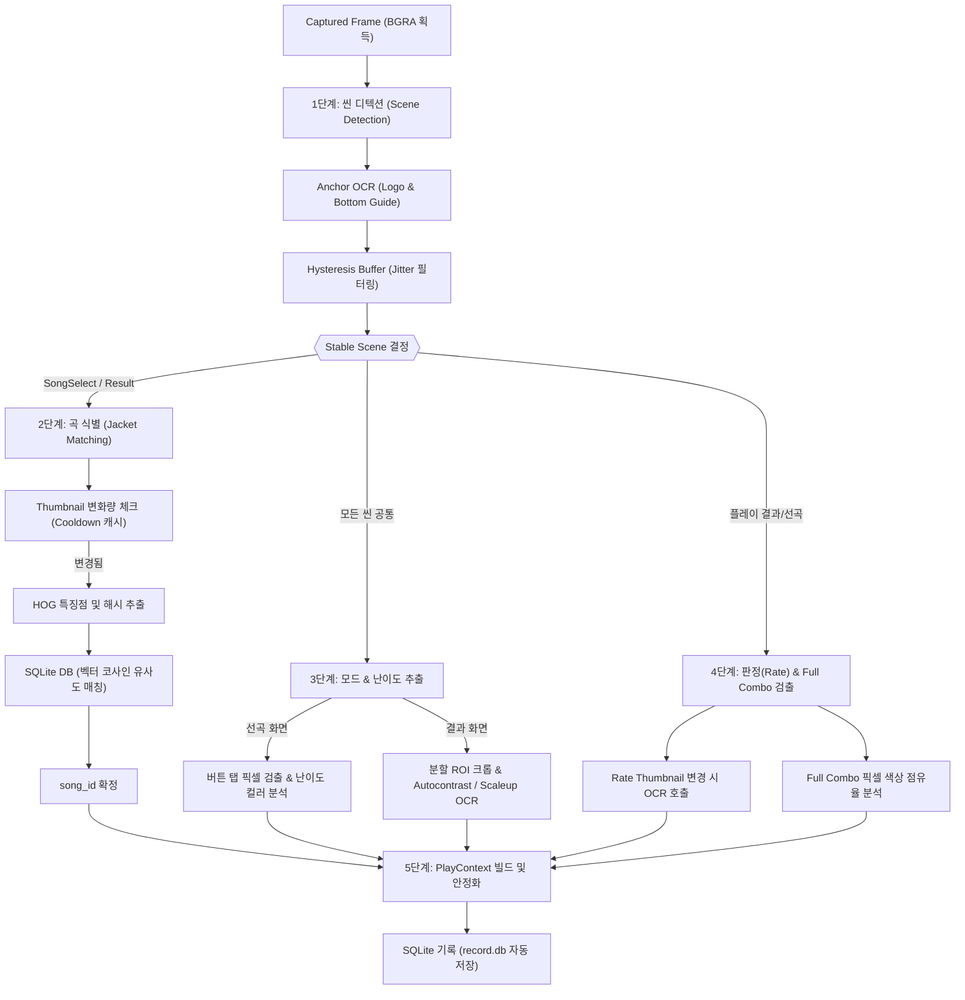

# DJMAX RESPECT V Overlay Detection Pipeline Architecture & Recognition Logic

이 문서는 DJMAX RESPECT V 오버레이 추천 시스템에서 화면 캡처 장치를 통해 입력받은 프레임을 해석하고, 플레이 컨텍스트(`PlayContext`)를 빌드하여 로컬 데이터베이스(`record.db`)에 누수 없이 저장하는 전체 디텍션 파이프라인의 아키텍처와 상세 인식 로직을 설명한다.

---

## 1. 파이프라인 아키텍처 개요

오버레이 시스템의 전체 흐름은 크게 4가지 단계로 분류된다.

---

## 2. 세부 탐지 단계 및 동작 원리

### 1단계: 씬 디텍션 (Scene Detection)
화면이 현재 곡을 고르는 중인지(선곡 화면), 게임 결과 화면인지(결과창)를 판별하여 뒤이어 실행할 무거운 매칭 로직들의 진입 여부를 제어한다.

* **Anchor 탐색**: 
  - **로고 기반 감지 (logo ROI)**: 화면 좌상단 로고 영역에서 `'BUTTON TUNES'`, `'FREESTYLE'`, `'ONLINE'`(LADDER/OPEN 포함) 등의 핵심 타이틀 텍스트를 OCR로 탐색하여 씬(`ResultFreestyle`, `Freestyle`, `OpenMatch`, `LadderMatch`, `ResultOpen2` 등)을 식별합니다.
  - **하단 가이드바 기반 1차 경량 Probing (bottom_guide ROI)**: 로고가 Unknown인 경우, 즉시 무거운 하단 OCR로 진입하는 대신 아주 좁은 하단 가이드바 영역을 먼저 OCR합니다. 이때 스페이스바 단축키 관련 단어(`Space` 혹은 한국어 `상세정보` 등)가 탐지되면 결과창 후보로, `F5` 관련 단어(`F5` 혹은 한국어 `레더보드`/`즐겨찾기` 등)가 탐지되면 프리스타일 결과창 후보로 1차 마킹합니다.
  - **2단계 Fallback OCR 및 씬 확정**: 1단계 가이드바 매칭으로 후보(Candidate) 플래그가 설정된 경우에만 비로소 2단계로 화면 하단 65% 영역을 크게 크롭하여 무거운 OCR(`recognize_bottom_half_with_rate_x`)을 수행하고, 판정 비율 패턴이나 레이아웃 비율을 검사해 최종 씬(`ResultOpen3`, `ResultOpen2`, `ResultFreestyle`)을 정밀 식별 및 확정합니다.
  - **인게임 Gameplay 최적화 (Heavy OCR Skip)**: 
    - 화면 하단 절반 영역 Fallback 및 가이드바 Fallback 감지는 연산 비용이 매우 높습니다. 
    - 프레임 버벅임을 원천 방지하기 위해, 선곡창 혹은 결과창 상태가 활성화되어 있는 세션 상태(`is_active_session = true`)일 때만 이 무거운 Fallback OCR들이 가동되도록 설계했습니다.
    - 실제 노트 연주 중(Gameplay)과 같이 세션이 비활성화되었을 때는 1단계 가이드바 probe 조차도 스킵하여 무거운 하단 영역 OCR을 전면 차단하고, 크기가 극히 작은 로고 영역(`logo` ROI, 320x75)만 0.3초 주기로 검사하여 CPU 점유율을 0.1% 미만으로 억제하고 프레임을 완벽히 보존합니다.
* **Hysteresis Buffer**:
  - 화면 전환 시 깜빡임(Jitter)으로 인해 씬 상태가 불안정하게 튀는 현상을 막기 위해, 최근 N프레임 동안 연속 감지 횟수를 이력으로 관리한다. 임계값(Threshold)을 초과하는 시점에만 비로소 확정 씬(Stable Scene) 상태를 업데이트한다.

### 2단계: 곡 식별을 위한 자켓 매칭 (Jacket Matching)
자켓 매칭은 파이프라인에서 가장 무거운 연산에 해당하므로, 다단계 캐싱 및 필터링을 통해 게임 플레이 성능 저하를 방지한다.

* **Thumbnail-based Cooldown (성능 최적화)**:
  - 크롭한 자켓 이미지의 매우 작은 미니 썸네일(`32x32`)을 캐싱하여, 프레임이 바뀔 때 이 썸네일 픽셀의 실질적인 변경 강도를 계산한다.
  - 썸네일이 변경되지 않았다면(선곡 커서가 멈췄거나 결과창이 정지 화면일 때), 자켓 매칭 연산을 전면 스킵하고 이전 캐시 데이터를 우회(Bypass) 활용한다.
* **HOG 특징점 및 해시 추출**:
  - 썸네일 변화가 감지되어 새로운 곡으로 판단되면, 크롭한 원본 자켓 영역에서 **HOG(Histogram of Oriented Gradients) 특징 벡터**와 이미지 고유 해시(pHash, dHash, aHash)를 추출한다.
* **SQLite 캐시 및 매칭**:
  - 추출한 HOG 특징 벡터와 로컬 이미지 인덱스 데이터베이스(`image_index.db`)에 보관된 수록곡들의 벡터 값을 대상으로 **코사인 유사도(Cosine Similarity)**를 산출하여 임계값(0.60) 이상이면서 가장 유사한 곡 ID(`song_id`)를 확정 짓는다.

### 3단계: 모드(mode) 및 난이도(diff) 감지
선택 또는 플레이한 곡의 세부 차트 정보(예: `6B SC`, `4B MX`)를 파싱하는 단계이다.

* **선곡창 (SongSelect)**:
  - **버튼 모드(mode)**: 상단 탭(`btn_mode` ROI)의 픽셀 좌표를 취해 활성화 탭 고유의 BGR 색상값과의 유클리드 거리를 계산하여 매칭한다 (`detect_button_mode`).
  - **난이도(diff)**: 선택 패널 내 난이도 뱃지의 컬러(SC=진보라/핫핑크, MX=빨강, HD=주황/당근, NM=노랑 등) 밝기 스펙트럼 강도를 분석하여 NM/HD/MX/SC를 확정한다 (`detect_difficulty`).
* **결과창 (Result Screen)**:
  - 결과창의 뱃지 배너(`mode_diff_badge`)는 해상도에 따라 너무 작고 그라데이션이 강해 픽셀 매칭이 불가능하다.
  - 이를 해결하기 위해 배너 전체(`width=300`)를 크롭한 뒤 내부적으로 **좌측 60%(mode_badge)**와 **우측 40%(diff_badge)**로 쪼개어 각각 crop 한다.
  - 크롭된 영역들의 높이가 작을 경우, Windows OCR이 읽을 수 있는 최소 높이인 `120px` 이상이 되도록 동적으로 배율을 계산해 스케일업(8x~11x)하고, 그레이스케일 이미지의 명암 대비를 인위적으로 극대화(`autocontrast_gray`)하여 텍스트를 정확하게 추출한다.

### 4단계: 판정(Rate) 및 Full Combo 감지
기록 저장(`PlayContext`)의 최종 완성을 위해, 최종 판정 수치와 풀콤보 뱃지 달성 여부를 판별한다.

* **Rate (판정율 OCR)**:
  - 판정율 숫자 영역(`rate` ROI)도 자켓 매칭과 마찬가지로, 매 프레임 OCR을 돌리는 것은 큰 병목이 되므로 `rate_img` 썸네일 변경 감지 시에만 OCR을 수행한다.
  - 그레이스케일, 이진화, 반전 패스 등 3단계의 OCR 패스(`attempt_rate_ocr`)를 순차 적용하여 소수점 백분율(예: `99.78%`)을 오차 없이 감지한다.
* **Full Combo 뱃지 패턴 매칭**:
  - **인게임 및 선곡창**: `max_combo_badge` ROI 영역의 평균 색조 밝기((B+G+R)/3)가 `160.0` 이상인지 확인하여 반짝이는 은색/금색 뱃지 활성 여부를 감지한다.
  - **결과창**: 결과창의 경우, 콤보 리본 및 PERFECT PLAY 그라데이션 배너 연출이 복잡하다. 따라서 해당 ROI 내의 민트색(Max Combo), 보라/핑크색(Perfect Play), 골드색(Freestyle Combo) 픽셀의 개수를 직접 전수 카운팅한다.
  - 해당 대표 색상 픽셀들의 점유율이 전체 ROI 영역의 **`3% 이상`**일 때 최종적으로 `is_max_combo = true` 판정을 내린다.

---

## 3. PlayContext 빌드 및 데이터 저장 (Upsert)

모든 데이터 탐지가 끝나면 파이프라인은 최종 컨텍스트를 안정화하여 저장 단계로 인계한다.

1. `song_id`, `mode`, `diff` 가 유효하게 검출되고 `Rate` 판정율이 정상 감지되었을 때 비로소 **`PlayContext`** 구조체가 생성된다.
2. 이 컨텍스트 상태가 프레임 이력 상 일정 주기 이상 안정화(Stable) 상태를 유지하면 최종 플레이 레코드로 간주한다.
3. 로컬 SQLite DB(`record.db`)의 레코드 테이블에 데이터가 Upsert(업데이트 혹은 추가) 됨으로써 플레이 기록 수집이 완결된다.

이 탐지 파이프라인의 소스코드는 다음 파일들에 분산되어 유기적으로 연동된다:
* 메인 탐지 파이프라인 제어: [detection_pipeline.rs](../rust/overmax_app/src/detection_pipeline.rs)
* ROI 설정: [scene_config.rs](../rust/overmax_data/src/scene_config.rs)
* 상태 전이 및 로직 탐지: [play_state.rs](../rust/overmax_app/src/play_state.rs)
* 이미지 특징점 및 전처리: [ocr.rs](../rust/overmax_cv/src/ocr.rs) / [lib.rs](../rust/overmax_cv/src/lib.rs)
* OCR 디텍션 매니징: [ocr_engine.rs](../rust/overmax_app/src/ocr_engine.rs)
