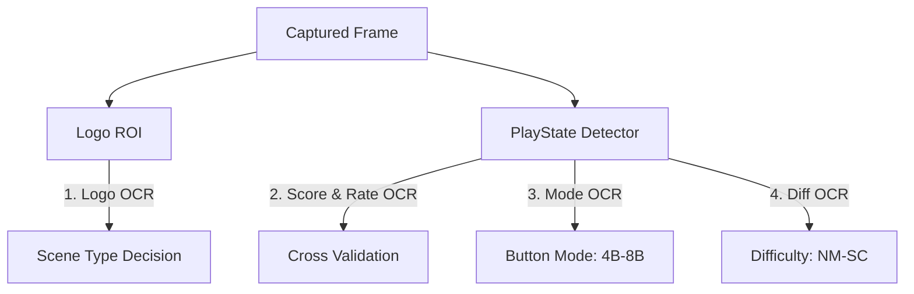

# OCR 의존성 제거 및 고속 템플릿 매칭 전향 설계안

- **작성일**: 2026-07-01
- **목표**: 실시간 분석 루프 내 Windows OCR 의존성을 완전 제거(0%)하고, 게임 도메인에 특화된 고성능 픽셀 템플릿 매칭 기법을 도입하여 CPU 오버헤드 단축 및 인식 안정성 극대화.

---

## 1. 개요 (Executive Summary)

현재 오버맥스(overmax) 오버레이 감지 파이프라인의 가장 큰 지연 요인(Bottleneck)은 Windows OCR API 호출입니다. Windows OCR은 비동기 WinRT 호출로 인해 IPC 오버헤드와 스레드 컨텍스트 스위칭 비용이 발생하며, 범용 언어 모델을 사용하기 때문에 고정 폰트의 게임 내 정보 감지 시 자릿수 누락 등의 오독 가능성이 항시 존재합니다.

게임 화면의 로고, 점수, 난이도, 버튼 모드 등은 디자인과 폰트가 완벽히 고정되어 있으므로, 굳이 무거운 OCR을 쓸 필요가 없습니다. 본 문서는 범용 OCR을 걷어내고, 초고속 Rust Native 픽셀 매칭 및 HOG/해시 매칭으로 전환하기 위한 기술 설계와 구현 계획을 기술합니다.

---

## 2. 현재 상태 분석 및 Bottlenecks (Current State)

시스템 전반에서 OCR이 사용되는 곳은 다음과 같이 4대 영역으로 나뉩니다.



### OCR 호출 비용 및 리스크 분석

| 사용 영역 | 호출 API | 호출 주기 / 시점 | 문제점 및 비효율성 |
| :--- | :--- | :--- | :--- |
| **1. 씬 판별 (로고)** | `detect_logo` | 매 200ms 단위 (로고 미확정 시) | 로고가 안정화되기 전까지 프레임 지연 유발 |
| **2. 수치 검증 (Score/Rate)** | `detect_rate`, `detect_score` | 200ms 쿨다운 기준 지속 실행 | **가장 심각한 루프 부하**. 소수점 누락, 자릿수 탈락(100% $\rightarrow$ 10%) Jitter 발생 |
| **3. 버튼 모드 (4B~8B)** | `recognize_text_all_passes` | 결과창 진입 시 성공 시까지 반복 | 4개 후보군(4B, 5B, 6B, 8B) 판독을 위해 무거운 루프 반복 |
| **4. 난이도 (NM~SC)** | `recognize_text_all_passes` | 결과창 진입 시 성공 시까지 반복 | 고정 폰트 문자 판독을 위해 OS OCR에 의존 |

---

## 3. 대안 아키텍처 설계 (Template Matching Design)

### 3.1. 수치 판독 (Score & Rate): 고정 폰트 Digit Matcher
게임 내 점수와 판정율은 고정 폰트 (`Dinamit` 계열)의 숫자(`0~9`), 소수점(`.`), 퍼센트(`%`) 총 12가지 문자만 사용합니다.

```
[동적 이미지 이진화] -> [수직 투영 (Vertical Projection) 글자 분할] -> [12종 템플릿 마스크 매칭]
```

1. **글자 영역 분할 (Segmentation)**:
   * Score / Rate ROI 이미지를 회색조(Grayscale) 변환 및 Otsu 임계값법을 적용해 이진화(Binarization)합니다.
   * 이진화 이미지에 대해 열 단위(Column-wise) 픽셀 합산값인 **수직 투영 프로젝션**을 수행합니다. 픽셀 합산이 0에 가까운 열(공백 구간)을 글자 경계선으로 삼아 개별 문자를 단번에 쪼갭니다.
2. **비트맵 매칭 (Matching)**:
   * 분할된 개별 문자 이미지의 크기를 템플릿 규격에 맞게 정규화합니다.
   * 12개의 표준 문자 템플릿 마스크와 1:1로 픽셀 유사도(SSD 또는 NCC)를 연산합니다.
   * **기대 효과**: 연산 속도가 마이크로초(μs) 단위로 수백 배 이상 단축되며, 모양이 완전히 구분되므로 오독이 0%에 수렴합니다.

### 3.2. 결과창 버튼 모드 및 난이도 마크: 고속 HOG/Color 매칭
* **버튼 모드 (4B~8B)**:
  * 각 버튼 모드는 고유의 텍스트 아이콘 리소스 형태입니다. 4종의 HOG 특징(Feature) 벡터를 미리 생성하여 상수로 두고, 크롭 영역의 HOG 벡터와 Euclidean 거리만 비교하여 씬 판별 시점처럼 고속 매칭합니다.
* **난이도 마크 (NM~SC)**:
  * 결과창의 난이도 아이콘은 색상 테마가 매우 명확합니다 (NM: 파랑, HD: 노랑, MX: 빨강, SC: 보라).
  * 굳이 글자를 읽지 않고 난이도 패널 영역의 **대표 BGR 색상 거리(Euclidean Distance)** 및 밝기 분포만 대조하여 난이도를 즉시 확정합니다.

### 3.3. 씬 로고 (Freestyle / OpenMatch) 판별
* 현재 구현된 HOG 템플릿 기반 로고 매칭 기능을 정밀화하여, 로고 OCR API를 거치지 않고 HOG 특징 매칭 스코어가 최저인 씬을 즉각 매칭하도록 전향합니다.

---

## 4. 단계별 구현 로드맵 (Roadmap)

```
[1단계: 템플릿 자산 수집] ──> [2단계: Rust 매칭 모듈 개발] ──> [3단계: OCR 제거 및 통합] ──> [4단계: Jitter 검증]
```

### 1단계: 템플릿 수집 및 전처리 도구 개발 (개발 기간: 2일)
* `scratch/screenshots` 내 실제 스냅샷들에서 0~9, 소수점, 퍼센트, 버튼 모드 영역을 크롭하여 표준 크기의 바이너리(흑백 마스크) 템플릿 데이터셋을 자동 추출하는 Python/Rust 유틸리티 개발.
* 추출한 표준 마스크 데이터를 Rust 배열 상수 형식(`TEMPLATE_DIGIT_0: [u8; N]` 등)으로 컴파일 시점에 탑재할 헤더(또는 소스 파일) 생성.

### 2단계: Rust 기반 픽셀 매칭 엔진 개발 (개발 기간: 3일)
* `overmax_cv` 크레이트 내에 픽셀 매칭 코어 모듈 개발.
  * `fn segment_characters(bin_img: &ImageRegion) -> Vec<ImageRegion>` (수직 투영 분할)
  * `fn match_digit(char_img: &ImageRegion) -> char` (12종 템플릿 SSD 매칭)
* HOG 특징 거리 판별기 추가 고도화.

### 3단계: OcrDetector 완전 대체 및 제거 (개발 기간: 2일)
* `PlayStateDetector` 및 `DetectionPipeline` 내의 모든 `ocr` 호출부를 새로 만든 Rust 템플릿 매칭 함수로 리팩토링.
* 프로젝트 의존성에서 Windows WinRT OCR 관련 코드(`ocr_engine.rs` 내 OS 종속 API 호출부)를 완전 삭제하거나 빌드 플래그로 비활성화.

### 4단계: 실시간 프레임 틱 벤치마크 및 검증 (개발 기간: 2일)
* 8장의 screenshots 및 신규 HD screenshots들을 대상으로 전체 감지 시나리오 회귀 테스트 실행.
* HOG 비활성화(disable_hog: true)와 OCR 0% 전향을 통해 확보된 CPU 소모율 및 매칭 성공률 최종 검토.

---

## 5. 기대 효과 (Expected Benefits)

1. **극적인 성능 향상**:
   * Windows OCR API의 호출 평균 소요 시간(10ms~50ms)이 템플릿 매칭 도입 시 **0.1ms 미만**으로 단축되어 감지 루프의 전반적인 반응성이 비약적으로 증가합니다.
2. **오독의 근본적 해결**:
   * 문자 획이 아주 미세하게 끊겨서 생기는 숫자 왜곡이나 자릿수 씹힘 등의 OCR 한계가 게임 도메인 고유 픽셀 마스크 대조를 통해 100% 해소됩니다.
3. **OS 독립성 및 플랫폼 이식성 확보**:
   * Windows WinRT OCR 의존성이 완전히 제거됨에 따라, 향후 Linux(Steam Deck/Proton 호환용) 또는 macOS 등 타 플랫폼으로의 오버레이 포팅이 매우 단순해집니다.
